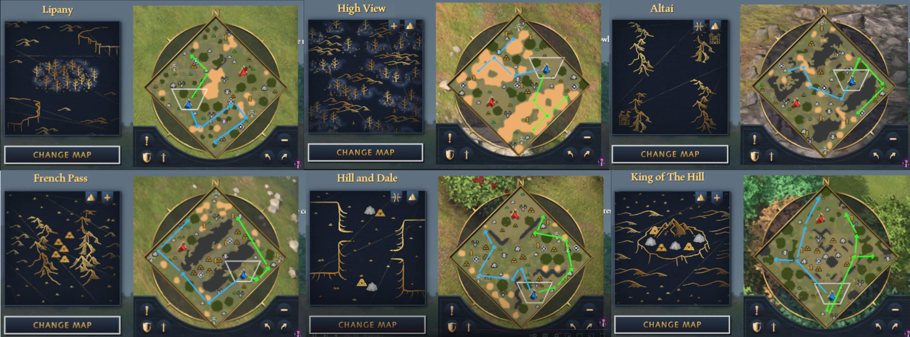

# Sheep Scouting

On every map there is a specific pattern to actually find the sheep's. This can be kept in mind so you don't get lost and can easily find the maximum amount of sheep's with least amount of distance covered by your scouts.

Below is the image which shows the pattern for perfect sheep scouting.

The above image was taken from this [reddit comment](https://old.reddit.com/r/aoe4/comments/u8tlu9/how_do_you_find_sheep/i5nz2e6/)

The image is not very self explanatory and if you want to watch a video on this then you can [see it here](https://www.youtube.com/watch?v=_s_N0Rb0EOE)

The basic idea is that the Blue is where you have spawned and the Red will be where your opponent spawn. And the blue lines are the scouting pattern for your first scout and the green one is for your second scout. Its obviously possible that you don't make 2 scouts and in that case you can just your one scout to first go to the blue path and then the green path.S
